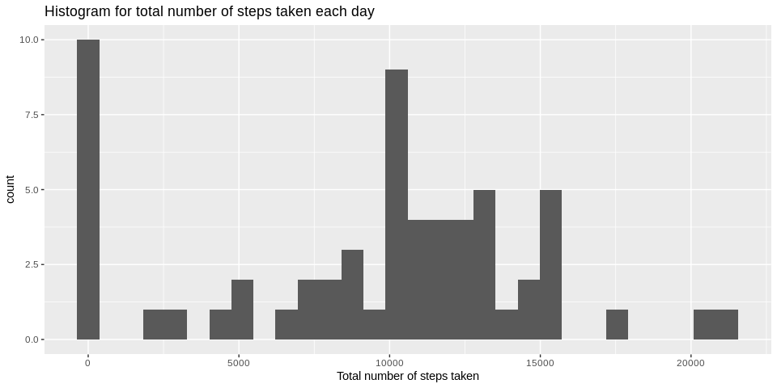
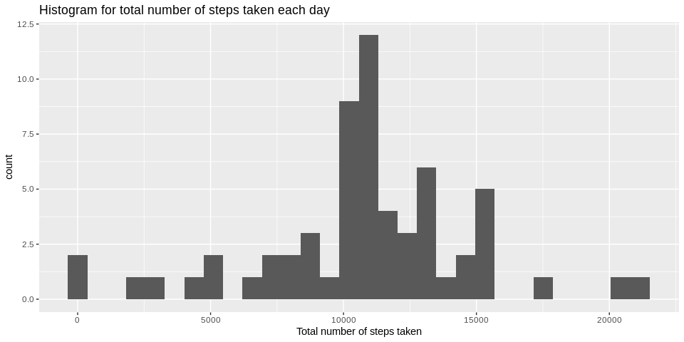

## Loading and preprocessing the data

```r
unzip('activity.zip')
data <- read.csv('activity.csv', stringsAsFactors = FALSE)
data$date <- as.Date(data$date, '%Y-%m-%d')
```


## What is mean total number of steps taken per day?  


```r
data1 <- data %>%
    group_by(date) %>%
    summarise(total_steps = sum(steps, na.rm = TRUE))

g <- ggplot(data1, aes(x = data1$date, y = data1$total_steps)) + geom_bar(stat = "identity") + ggtitle("Histogram for total number of steps taken each day") + xlab("Date") + ylab("Total number of steps taken")
print(g)
```

<!-- -->

```r
print(paste0("Mean total number of steps taken per day = ", mean(data1$total_steps)))
```

[1] "Mean total number of steps taken per day = 9354.22950819672"

```r
print(paste0("Median total number of steps taken per day = ", median(data1$total_steps)))
```

[1] "Median total number of steps taken per day = 10395"

## What is the average daily activity pattern?


```r
data2 <- data %>%
    group_by(interval) %>%
    summarise(avg_steps = mean(steps, na.rm = TRUE))

g <- ggplot(data2, aes(x = data2$interval, y = data2$avg_steps)) + geom_line() + scale_x_continuous(breaks = pretty(data2$interval, n = 18)) + ggtitle("Time series plot for average number of steps taken per 5-minute interval accross all days") + xlab("Interval") + ylab("Avg. number of steps taken")
print(g)
```

<!-- -->

```r
print(paste0("The 5-minute interval with maximum avg. no. of steps taken is: ", subset(data2, avg_steps == max(avg_steps))[, "interval"]))
```

[1] "The 5-minute interval with maximum avg. no. of steps taken is: 835"

## Imputing missing values

```r
print(paste0("The total number of missing values in the given dataset = ", sum(is.na(data))))
```

[1] "The total number of missing values in the given dataset = 2304"

```r
# Strategy - Missing values are imputed with the rounded value of mean of the 5-minute interval.

impute.mean <- function(x){replace(x, is.na(x), round(mean(x, na.rm = TRUE)))}
data3 <- data %>%
    group_by(interval) %>%
    mutate(steps = impute.mean(steps))

data4 <- data3 %>%
    group_by(date) %>%
    summarise(total_steps = sum(steps, na.rm = TRUE))

g <- ggplot(data4, aes(x = data4$date, y = data4$total_steps)) + geom_bar(stat = "identity") + ggtitle("Histogram for total number of steps taken each day") + xlab("Date") + ylab("Total number of steps taken")
print(g)
```

<!-- -->

```r
print(paste0("Mean total number of steps taken per day = ", mean(data4$total_steps)))
```

[1] "Mean total number of steps taken per day = 10765.6393442623"

```r
print(paste0("Median total number of steps taken per day = ", median(data4$total_steps)))
```

[1] "Median total number of steps taken per day = 10762"

The mean and median of the total number of steps taken each day differ after imputing the missing values. Imputing missing values increases the estimates of the total daily number of steps.

## Are there differences in activity patterns between weekdays and weekends?

```r
data3$day <- as.factor(weekdays(data3$date))

levels(data3$day)[levels(data3$day)=="Monday"] <- "weekday"
levels(data3$day)[levels(data3$day)=="Tuesday"] <- "weekday"
levels(data3$day)[levels(data3$day)=="Wednesday"] <- "weekday"
levels(data3$day)[levels(data3$day)=="Thursday"] <- "weekday"
levels(data3$day)[levels(data3$day)=="Friday"] <- "weekday"
levels(data3$day)[levels(data3$day)=="Saturday"] <- "weekend"
levels(data3$day)[levels(data3$day)=="Sunday"] <- "weekend"

data5 <- data3 %>%
    group_by(interval, day) %>%
    summarise(avg_steps = mean(steps))

g <- ggplot(data5, aes(x = data5$interval, y = data5$avg_steps)) + geom_line() + scale_x_continuous(breaks = pretty(data2$interval, n = 18)) + facet_grid(data5$day~.) + ggtitle("Time series plot for avg. number of steps taken per 5-minute interval accross all weekday days and weekend days") + xlab("Interval") + ylab("Avg. number of steps taken")
print(g)
```

<!-- -->
